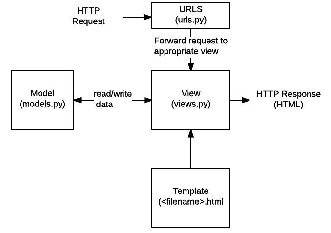
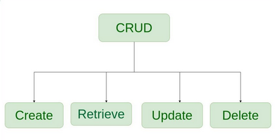
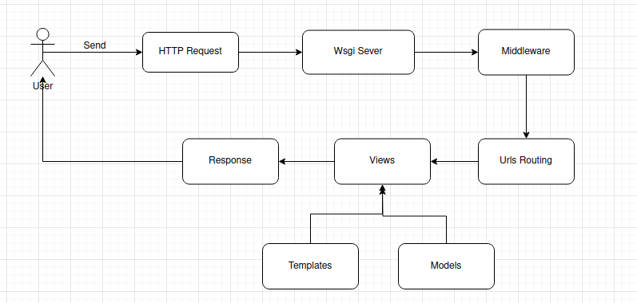

# Django Framework
-  Django is high level web framework that eases the pain of building dynamic web sites . its abstract 
   common problems of web development. The django framework is written in Python, a beautiful, concise, powerful, high-level programming language. To develop a site using
   Django, you write Python code that uses the Django libraries. 

- Python is an interpreted language, which means there’s no need to compile code. Just write your   
  program and execute it.In Web development, this means you can develop code and immediately see results by hitting “reload” in your Web browser.Python is dynamically typed, which means you don’t have to worry about declaring data types for your variables.Python syntax is concise yet expressive, which means it takes less code to accomplish the same task than in other, more verbose, languages such as Java. One line of python usually equals 10 lines of Java. (This has a convenient side benefit:
  Fewer lines of code means fewer bugs.)Python offers powerful introspection and meta-programming features, which make it possible to inspect and add behavior to objects at runtime.

# How Django Work ?

## Django Views 
- Django Views are the backbone of handling user requests and rendering responses. There are two primary  
  paradigms for implementing views: Function Based Views (FBVs) and Class Based Views (CBVs). 

## Django Models
- Django Model is the backbone of database operations, facilitating seamless management of data. This 
  guide delves into various aspects of Django Models, starting from the fundamental operations of inserting, updating, and deleting data using the Object-Relational Mapping (ORM) provided by Django.

## Django Urls
- a crucial mechanism for directing incoming requests to the appropriate views within your web application.

## Django Templates 
- this contain on frontend pages and through it can easily connect between frontend and backend .

# MVT Architecture Summary

- Model
  - Handles the database.
  - Define the structure of data

- View
   - Processes requests and business logic.
   - Retrieves or updates data using models.
   - Returns responses (HTML, JSON).

- Template
  - Defines how data is presented to the user .

# Lifecycle of a Request

# Serializer
Serializers are a cornerstone of building REST APIs in Django.a serializer is a tool provided by the Django REST Framework (DRF) to convert complex data types (such   
as Django models or querysets) into native Python data types (like dictionaries) or JSON, which can then be rendered into easily readable formats for APIs. It also performs the reverse operation, allowing parsed data (like JSON) to be converted back into complex types.

# Middleware 
middleware is a framework that allows you to process requests and responses globally for your application. Middleware components are Python classes that can perform operations on HTTP requests, responses, or both, before or after they are handled by a view.
## Key Responsibilities of Middleware
- Middleware in Django can:
    - Modify Requests: Pre-process the incoming HTTP request before it reaches the view.
    - Modify Responses: Post-process the response before it is sent to the client.
    - Handle Exceptions: Process exceptions raised by views or other middleware.
    - Perform Other Tasks: Implement functionalities like session management, user authentication, or 
      logging.

## How Middleware Works ?
- When a request is made to a Django application:
    1- The request passes through each middleware component in the MIDDLEWARE setting in order.
    2- The request is processed by the view.
    3- The response generated by the view passes back through the middleware in reverse order.

